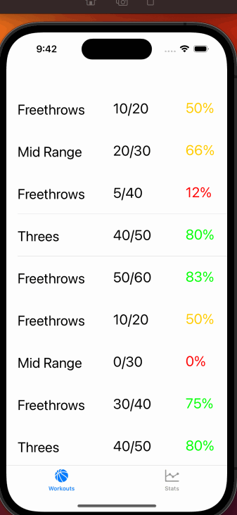

# Basketball Shot Tracker

## Table of Contents

1. [Overview](#Overview)
2. [Product Spec](#Product-Spec)
3. [Wireframes](#Wireframes)
4. [Schema](#Schema)

## Overview

### Description

**Basketball Shot Tracker** is an app that allows users to track statistics about their basketball shooting workouts. This includes allowing users to log entries about their shooting workouts and see statistics about their performance and progress.

### App Evaluation

- **Category:** Sports
- **Mobile:** Would be able to access it on the court.
- **Story:** More specific than the other two, but would be useful to target audience.
- **Market:** Basketball players, so smaller than other two.
- **Habit:** Would motivate players to achieve higher numbers in their made shots.
- **Scope:** Basic app would at least show shooting percentages, but more types of statisitics could be shown in the future.

## Product Spec

### 1. User Stories (Required and Optional)

**Required Must-have Stories**

- [ ] User can create entries.
- [x] User can view entries.
- [ ] User can view details about entries.
- [ ] User can see statistics about all entries.
- [ ] Entries will be saved using local persistence.

**Optional Nice-to-have Stories**
- [ ] User can update entries.
- [ ] User can delete entries.

### 2. Screen Archetypes

- [x] Entries screen
* User can view entries.
- [ ] Add Entry screen
* User can create entries.
- [ ] Details screen
* User can view details about entries.
- [ ] Stats screen
* User can see statistics about all entries.

### 3. Navigation

**Tab Navigation** (Tab to Screen)

* Entries screen
* Stats screen

**Flow Navigation** (Screen to Screen)

- [ ] Entries screen
* Clicking on entry will bring up details screen.
* Clicking add button will lead to entry creation screen.
- [ ] Details screen
* Clicking done after completing entry will go back to Entries screen.

## Wireframes

## Schema 

[This section will be completed in Unit 9]

### Models

- N/A

### Networking

- N/A

## Sprint Planning

### Main Features
- Entries screen with Tableview of entries.
- Stats screen with statistical details about all entries.
- Details screen that shows all parts of each entry.
- Add Entry screen that allows user to create an entry.
- Local data persistence.

### Sprint 1
- Setup basis of project.
- Create layout of screens and create objects/files needed.
- Entries screen with Tableview of entries.

#### Post Sprint 1 Update

Was able to create all of the above features, no major errors were encountered. The framework for sprint 2 has been laid out, which I will do this week. My first goal will be to create the screen that allows users to create entries, and once that is complete I will focus on building the stats and details screens after. I would like to be able to implement some of the stretch features like updating and deleting entries if time permits.

### Sprint 2
- Stats screen with statistical details about all entries.
- Details screen that shows all parts of each entry.
- Add Entry screen that allows user to create an entry.
- Local data persistence.
