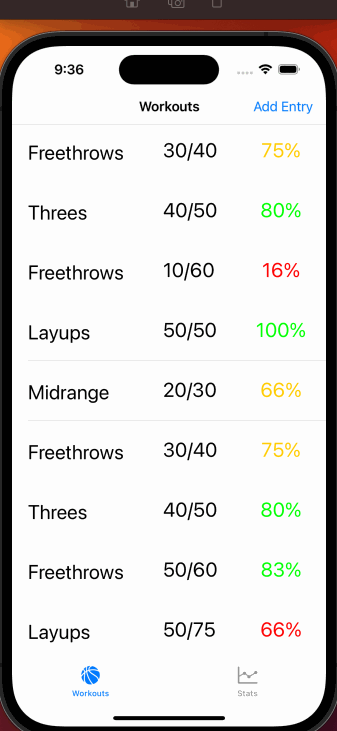
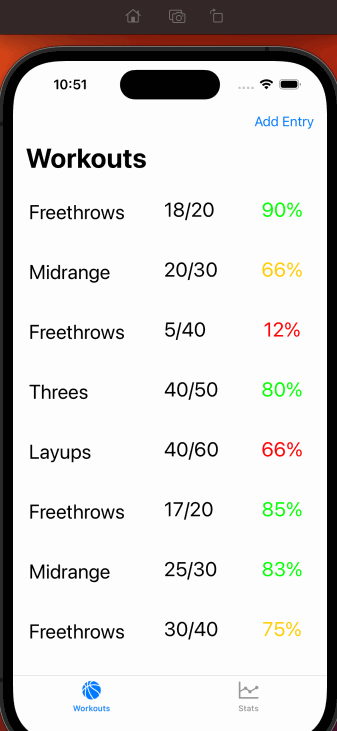

# Basketball Shot Tracker

## Table of Contents

1. [Overview](#Overview)
2. [Product Spec](#Product-Spec)
3. [Wireframes](#Wireframes)
4. [Schema](#Schema)

## Overview

### Description

**Basketball Shot Tracker** is an app that allows users to track statistics about their basketball shooting workouts. This includes allowing users to log entries about their shooting workouts and see statistics about their performance and progress.

### App Evaluation

- **Category:** Sports
- **Mobile:** Would be able to access it on the court.
- **Story:** More specific than the other two, but would be useful to target audience.
- **Market:** Basketball players, so smaller than other two.
- **Habit:** Would motivate players to achieve higher numbers in their made shots.
- **Scope:** Basic app would at least show shooting percentages, but more types of statisitics could be shown in the future.

## Product Spec

### 1. User Stories (Required and Optional)

**Required Must-have Stories**

- [x] User can create entries.
- [x] User can view entries.
- [x] User can view details about entries.
- [x] User can see statistics about all entries.
- [x] Entries will be saved using local persistence.

**Optional Nice-to-have Stories**
- [ ] User can update entries.
- [x] User can delete entries.

### 2. Screen Archetypes

- [x] Entries screen
* User can view entries.
- [x] Add Entry screen
* User can create entries.
- [x] Details screen
* User can view details about entries.
- [x] Stats screen
* User can see statistics about all entries.

### 3. Navigation

**Tab Navigation** (Tab to Screen)

* Entries screen
* Stats screen

**Flow Navigation** (Screen to Screen)

- [x] Entries screen
* Clicking on entry will bring up details screen.
* Clicking add button will lead to entry creation screen.
- [x] Details screen
* Clicking done after completing entry will go back to Entries screen.

## Wireframes

## Schema 

### Models

- N/A

### Networking

- N/A

## Sprint Planning

### Main Features
- Entries screen with Tableview of entries.
- Stats screen with statistical details about all entries.
- Details screen that shows all parts of each entry.
- Add Entry screen that allows user to create an entry.
- Local data persistence.

### Sprint 1
- Setup basis of project.
- Create layout of screens and create objects/files needed.
- Entries screen with Tableview of entries.

#### Post Sprint 1 Update

Was able to create all of the above features, no major errors were encountered. The framework for sprint 2 has been laid out, which I will do this week. My first goal will be to create the screen that allows users to create entries, and once that is complete I will focus on building the stats and details screens after. I would like to be able to implement some of the stretch features like updating and deleting entries if time permits.

### Sprint 2
- Stats screen with statistical details about all entries.
- Details screen that shows all parts of each entry.
- Add Entry screen that allows user to create an entry.
- Local data persistence.

This sprint was a lot of work, but I was able to mostly complete all of the features above. The stats screen does show stats about user entered data, the details screen gives users more info about each entry in the tableview, and local data persistence is used to store the data. The add entry screen does allow users to enter new entries, but I had trouble figuring out a certain button layout for one of the attributes. Besides that, all went well. In spring 3 I will figure out the rest of that button and will make finishing touches to the app and decide if any other features are needed. 

### Sprint 3
-Clean up app and make finishing touches

Made some finishing touches on the app and finished the dropdown button that allows users to select the type of shot for entries. Some parts of code were refactored for efficiency. At this point the app is functionally in form as the minimum viable product. I would like to add more in the future, both with funcionality and the user interface. At this point the main ability for a user to store entries and see stats about them is complete, which was the goal for the three sprints to begin this project. At this point I can also reflect how far I feel that I have come in iOS development. Ten weeks ago I knew nothing about iOS development. Now, I'm able to build a fully functioning app and understand why each component works the way it does.

